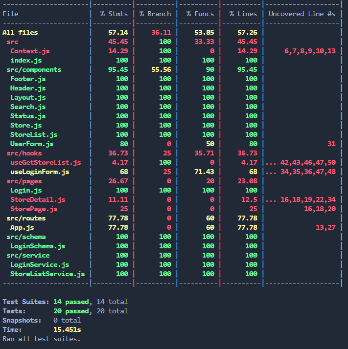
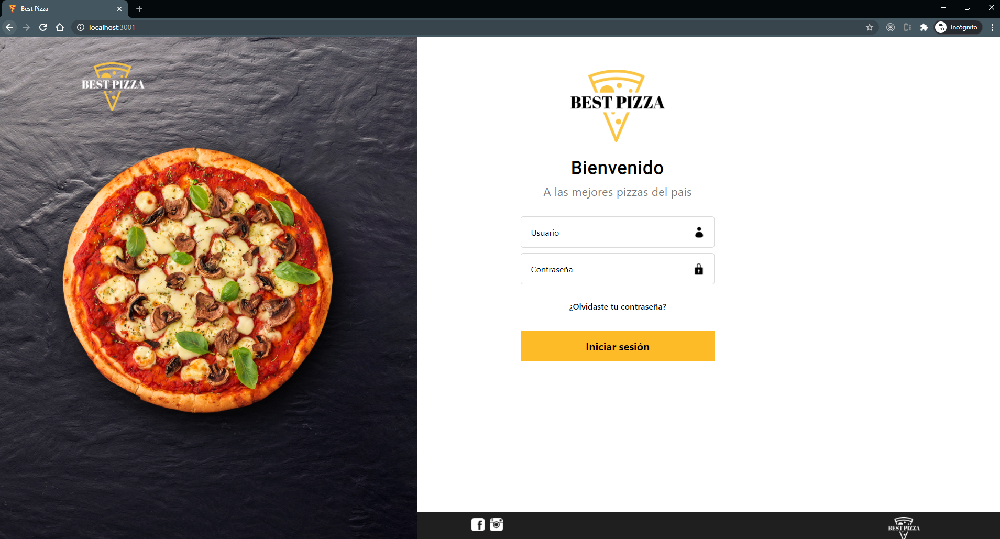

# MUY Frontend

Coding challenge.

## Capture report of unit tests of the app

## Screenshots App

### Screenshots login

### Screenshots store

### Screenshots detail

## Application in Vercel

[See the application in https://best-pizza.vercel.app/](https://best-pizza.vercel.app/)

## How does it work?

Requires Node.JS > 10

- `npm install` To install the dependencies.
- `npm run start` To start the development environment.
- `npm run build` To build the production environment.
- `npm run test` To run the unit tests.
- `npm run test:coverage` To generate the unit test report.

## Licencia

MIT